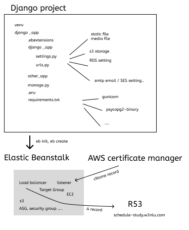

# Deploy Django project with AWS EB

## Clone project in local machine

1. cd coursessM, add .env file
2. python3 manage.py collectstatic
3. python3 manage.py runserver

## if project runs without error on local machine, then deploy to EB.

- install EB cli
- create .ebextensions folder, add django.config file under this folder.
- run eb init, then eb create
- if no error after creating, then eb open.

## Use your own domain name

1. Use ACM to request certificate, add certificate for Load balancer's listener
2. Add a A record in Route53, add alias by selecting with Application Load balancer created by EB.

